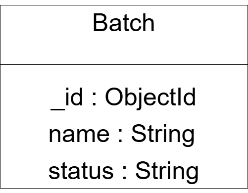

# AI-Powered-Batch-Traceability-Platform

AI-powered full-stack web application for batch traceability, quality monitoring, and compliance reporting.

## Tech Stack

- React (Vite)
- Node.js
- Express.js
- Axios
- Tailwind CSS

## Frontend Setup

```bash
npm install
npm run dev
```

Frontend runs at:

```
http://localhost:5173
```

## Backend Setup

Open a new terminal:

```bash
cd backend
npm install
npm run dev
```

Backend runs at:

```
http://localhost:5000
```

## API Endpoints

- GET `/api/batches`
- GET `/api/batches/:id`
- POST `/api/batches`
- PUT `/api/batches/:id`
- DELETE `/api/batches/:id`
- GET `/api/batches/search?q=HB001`

## Environment Variables

Create a `.env` file inside the `backend` folder:

```
PORT=5000
```

The `.env` file is ignored using `.gitignore`.

## Database

This project uses **MongoDB Atlas** as the cloud database and **Mongoose** as the ODM.

### Why MongoDB?

- Flexible document-based database
- Easy integration with Node.js
- Free cloud hosting using MongoDB Atlas
- Suitable for CRUD applications


## Database Schema


The application contains one collection:

### Batch

- name (String)
- status (String)


## Setup the Database

1. Create a MongoDB Atlas account.
2. Create a free cluster.
3. Create a database user.
4. Add your IP Address.
5. Copy the connection string.
6. Create a `.env` file inside the backend folder.
7. Add the following:

```env
PORT=5000
MONGO_URI=your_mongodb_connection_string
```

8. Install dependencies

```bash
npm install
```

9. Start the backend

```bash
npm start
```