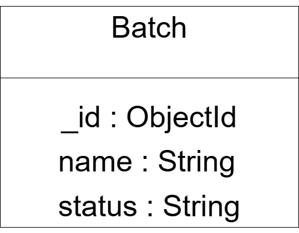

# AI-Powered Batch Traceability Platform

**Built with React • Node.js • Express.js • MongoDB Atlas • Hugging Face Router API**

An AI-powered full-stack web application for herbal batch traceability, quality monitoring, batch management, and AI-generated compliance reporting. The platform enables users to manage herbal product batches, authenticate securely using JWT and Google OAuth, and generate AI-powered quality reports using the Hugging Face Router API.

---

# Tech Stack

## Frontend
- React (Vite)
- Tailwind CSS
- Axios
- React Router DOM

## Backend
- Node.js
- Express.js
- JWT Authentication
- Passport.js (Google OAuth)

## Database
- MongoDB Atlas
- Mongoose

## AI Integration
- Hugging Face Router API
- OpenAI SDK

## Deployment
- Vercel (Frontend)
- Render (Backend)

---

# Project Features

- User Registration & Login
- Google OAuth Authentication
- JWT Protected Routes
- Batch Management (CRUD Operations)
- Batch Search
- MongoDB Atlas Integration
- AI-Powered Product-Specific Quality Reports
- Batch Quantity & Unit Management
- Dynamic Batch Selection
- Markdown Report Rendering
- Responsive Dashboard
- Error Handling

---

# Frontend Setup

Install dependencies:

```bash
npm install
```

Run the frontend:

```bash
npm run dev
```

Frontend runs at:

```
http://localhost:5173
```

---

# Backend Setup

Open a new terminal:

```bash
cd backend
npm install
npm run dev
```

Backend runs at:

```
http://localhost:5000
```

---

# API Endpoints

## Batch APIs

- GET `/api/batches`
- GET `/api/batches/:id`
- POST `/api/batches`
- PUT `/api/batches/:id`
- DELETE `/api/batches/:id`
- GET `/api/batches/search?q=HB001`

## Authentication APIs

- POST `/api/auth/register`
- POST `/api/auth/login`
- GET `/api/auth/google`

## AI APIs

- POST `/api/ai/quality-report`

---

# Environment Variables

Create a `.env` file inside the `backend` folder.

```env
PORT=5000
MONGO_URI=your_mongodb_connection_string
JWT_SECRET=your_jwt_secret
SESSION_SECRET=your_session_secret
CLIENT_URL=your_frontend_url
GOOGLE_CLIENT_ID=your_google_client_id
GOOGLE_CLIENT_SECRET=your_google_client_secret
GOOGLE_CALLBACK_URL=your_google_callback_url
HF_TOKEN=your_huggingface_router_api_key
```

---

# Database

The application uses **MongoDB Atlas** as the cloud database.

## Why MongoDB Atlas?

- Flexible document-based database
- Easy integration with Node.js
- Free cloud hosting
- Ideal for CRUD applications

---

# Database Schema



## Batch Collection

| Field | Type |
|--------|------|
| batchId | String |
| product | String |
| quantity | Number |
| unit | String |
| status | String |

---

# Database Setup

1. Create a MongoDB Atlas account.
2. Create a free cluster.
3. Create a database user.
4. Add your IP Address.
5. Copy the MongoDB connection string.
6. Create the `.env` file inside the backend folder.
7. Add the required environment variables.
8. Install dependencies.

```bash
npm install
```

9. Start the backend.

```bash
npm start
```

---

# AI Quality Report Generator

The application includes an AI-powered Quality Report Generator using the Hugging Face Router API.

### Features

- AI-generated Quality Assessment
- Risk Analysis
- Storage Recommendations
- Compliance Remarks
- Final Recommendation
- Product-specific Reports
- Batch-specific Reports
- Markdown Report Rendering
- Dynamic Batch Selection

---

# Live Deployment

## Frontend (Vercel)

https://ai-powered-batch-traceability-platf.vercel.app

## Backend (Render)

https://ai-powered-batch-traceability-platform.onrender.com

---

# Known Limitations

- Backend is hosted on Render Free Tier.
- Render free instances spin down after inactivity.
- The first request after inactivity may take approximately 30–60 seconds.
- AI report generation depends on Hugging Face API availability.

---

# Future Enhancements

- Advanced Analytics Dashboard
- Batch History Tracking
- PDF Report Export
- Email Notifications
- Role-Based Access Control
- Inventory Management
- QR Code Batch Tracking

---

# Author

**Aviral Dabral**

B.Tech Computer Science & Engineering

TBI-GEU Summer Internship 2026

---

# License

This project is developed for educational purposes as part of the **TBI-GEU Summer Internship 2026**.